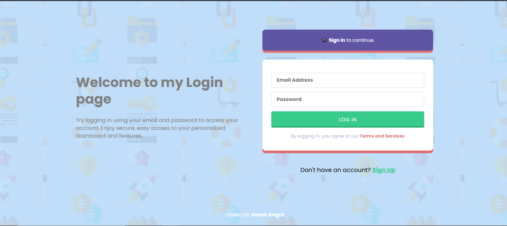
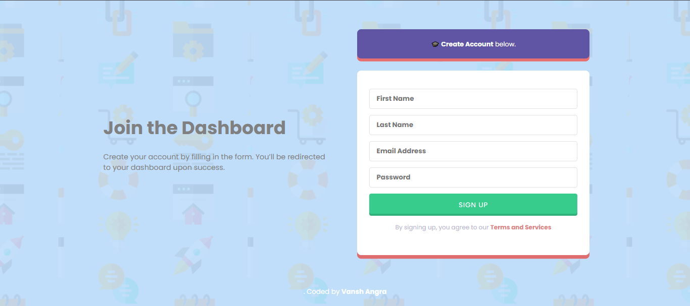

# Stude# StudentPortalX 🚀

A responsive full-stack student dashboard web app built using Node.js, Express, SQLite, and modern frontend technologies. Designed for personalized student profiles with secure login, rich UI, and social media integration.

---

## 🖼️ Project Preview

### 🔐 Login Page

### 📝 Signup Page

### 📊 Dashboard

---

## ✨ Features

- 🔐 **User Authentication** – Secure signup & login with password hashing
- 👤 **Personal Dashboard** – Profile picture, bio, and contact info
- 🌐 **Social Links** – LinkedIn, GitHub, Twitter, Instagram
- 📬 **Contact Section** – Direct Gmail link
- 🧼 **Responsive Design** – Works smoothly on desktop and mobile
- 🗃️ **Database Integration** – User data stored in SQLite

---

## 🛠️ Tech Stack

- **Frontend:** HTML5, CSS3, JavaScript
- **Backend:** Node.js, Express.js
- **Database:** SQLite3
- **Extras:** bcrypt (for hashing), body-parser

---
